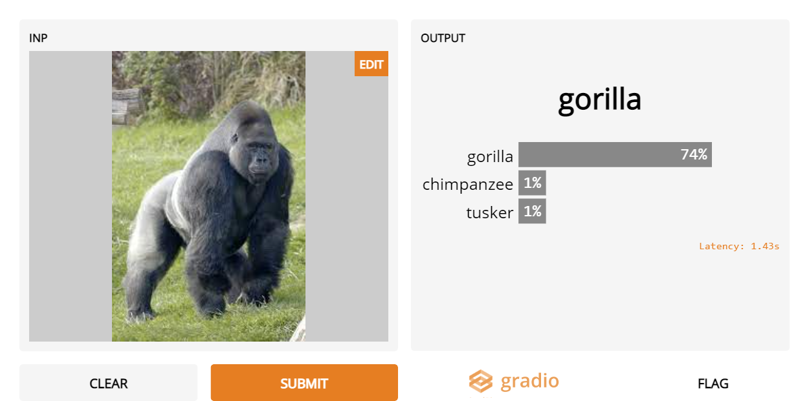
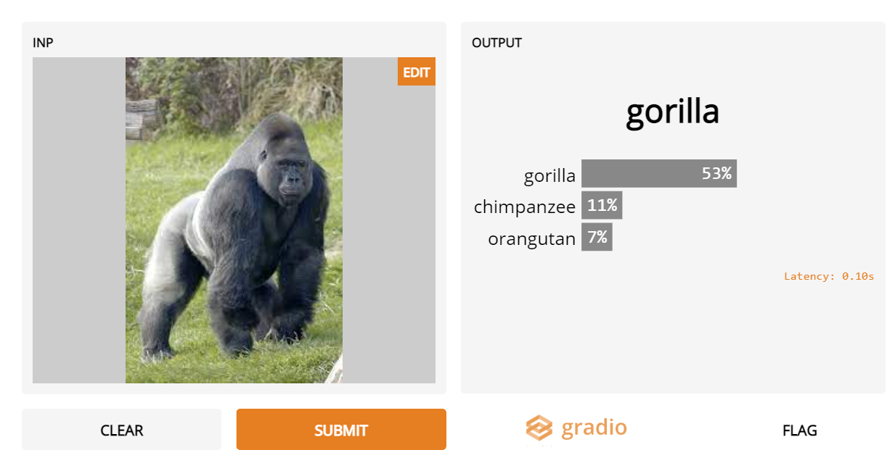

### Image-Classification

Image Classification done via pretrained models like InceptionNet and ResNet18,using Gradio framework.

What is Gradio?

Gradio is a customizable UI that is integrated with Tensorflow or Pytorch models. It is free and an open-source framework makes it readily available to anyone.

Step 1:

Installing Dependencies
```
- !pip install -q gradio

```

Step 2:

Testing the accuracy of different models using a same image,we are testing two models out here like InceptionNET and ResNET18

1. Inception Net image classifier




2. ResNET18


